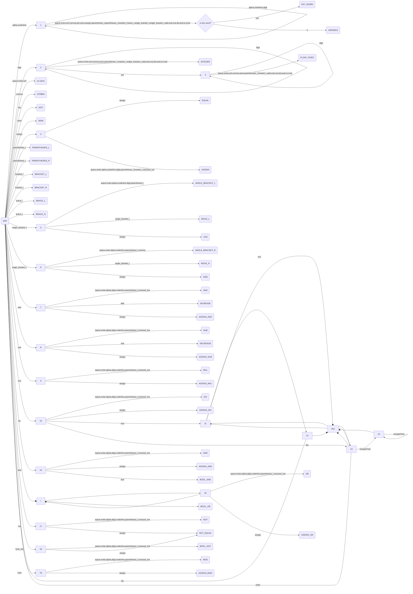

# Lexer
# FM（有限自动机）

```mermaid
graph LR
    0(start) --alpha,underline--> 1;
    0 --digit--> 2;
    0 --space,enter,eof--> 0.1(no token);
    0 --comma--> 0.2(COMMA);
    0 --dot--> 0.3(DOT);
    0 --semi--> 0.4(SEMI);
    0 --assign--> 4;
    0 --parentheses_l--> 0.5(PARENTHESES_L);
    0 --parentheses_r--> 0.6(PARENTHESES_R);
    0 --bracket_l--> 0.7(BRACKET_L);
    0 --bracket_r--> 0.8(BRACKET_R);
    0 --brace_l--> 0.9(BRACE_L);
    0 --brace_r--> 0.10(BRACE_R);
    0 --angle_bracket_l--> 5;
    0 --angle_bracket_r--> 6;
    0 --add--> 7;
    0 --sub--> 8;
    0 --mul--> 9;
    0 --div--> 10;
    0 --and--> 15;
    0 --or--> 16;
    0 --not--> 17;
    0 --bool_not--> 18;
    0 --mod--> 19;

    1 --alpha,underline,digit--> 1;
    1 --space,enter,eof,comma,dot,semi,assign,parentheses_l,parentheses_r,bracket_l,brace_l,angle_bracket_l,angle_bracket_r,add,sub,mul,div,and,or,mod--> 1.1{is key word?};

    2 --digit--> 2;
    2 --space,enter,eof,comma,semi,parentheses_r,bracket_r,angle_bracket_r,add,sub,mul,div,and,or,mod--> 2.1(INTEGER);
    2 --dot--> 3;

    1.1 --yes--> 1.1.1(KEY_WORD);
    1.1 --no--> 1.1.2(VARIABLE);

    3 --digit--> 3;
    3 --space,enter,eof,comma,semi,parentheses_r,bracket_r,add,sub,mul,div,and,or,mod--> 3.1(FLOAT_POINT);

    4 --assign--> 4.1(EQUAL);
    4 --space,enter,alpha,underline,digit,parentheses_l,bracket_l,not,bool_not--> 4.2(ASSIGN);

    5 --space,enter,alpha,underline,digit,parentheses_l--> 5.1(ANGLE_BRACKET_L);
    5 --angle_bracket_l--> 5.2(MOVE_L);
    5 --assign--> 5.3(LEQ);

    6 --space,enter,alpha,underline,parentheses_l,comma-->6.1(ANGLE_BRACKET_R);
    6 --angle_bracket_r--> 6.2(MOVE_R);
    6 --assign--> 6.3(GEQ);

    7 --space,enter,alpha,digit,underline,parentheses_l,not,bool_not--> 7.1(ADD);
    7 --add--> 7.2(INCREASE);
    7 --assign--> 7.3(ASSIGN_ADD);

    8 --space,enter,alpha,digit,underline,parentheses_l,not,bool_not--> 8.1(SUB);
    8 --sub--> 8.2(DECREASE);
    8 --assign--> 8.3(ASSIGN_SUB);

    9 --space,enter,alpha,digit,underline,parentheses_l,not,bool_not--> 9.1(MUL);
    9 --assign--> 9.2(ASSIGN_MUL);

    10 --space,enter,alpha,digit,underline,parentheses_l,not,bool_not--> 10.1(DIV);
    10 --assign--> 10.2(ASSIGN_DIV);
    10 --mul--> 11;
    10 --div--> 13;

    11 --mul--> 12;
    11 --other--> 11;

    12 --div--> 0;
    12 --other--> 11;

    13 --escapeChar--> 14;
    13 --enter--> 0;
    13 --other--> 13;

    14 --escapeChar--> 14;
    14 --other--> 13;

    15 --space,enter,alpha,digit,underline,parentheses_l,not,bool_not--> 15.1(AND);
    15 --assign--> 15.2(ASSIGN_AND);
    15 --and--> 15.3(BOOL_AND);

    16 --space,enter,alpha,digit,underline,parentheses_l,not,bool_not--> 16.1(OR);
    16 --assign--> 16.2(ASSIGN_OR);
    16 --or--> 16.3(BOOL_OR);

    17 --space,enter,alpha,digit,underline,parentheses_l,not,bool_not--> 17.1(NOT);
    17 --assign--> 17.2(ASSIGN_NOT);

    18 --space,enter,alpha,digit,underline,parentheses_l,not,bool_not--> 18.1(BOOL_NOT);
    18 --assign--> 17.2(NOT_EQUAL);

    19 --space,enter,alpha,digit,underline,parentheses_l,not,bool_not--> 19.1(MOD);
    19 --assign--> 19.2(ASSIGN_MOD);
```