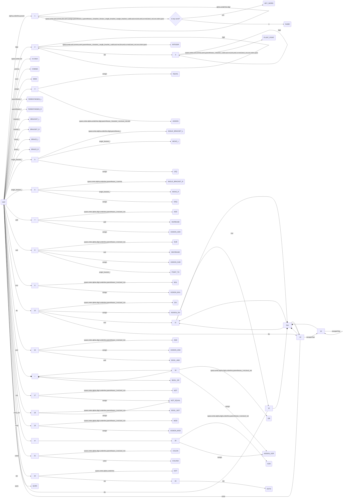

# 数据局部性分析
静态局部性分析很困难，必须让程序跑起来才能测出较为准确的局部性指标（访存地址序列长度、footprint、最大重用距离），为此我们需要分析代码生成IR（拟采用三元式作为IR），并且开发一个小型虚拟机来运行IR。但是，若循环迭代的范围过大，那么局部性分析的开销会变得很大。针对这种情况，应引入缩放系数，将迭代范围与缩放系数相乘得到缩小后的迭代范围，基于缩小后迭代范围进行局部性分析，测出的指标按照缩放系数比例放大，可得到较精确的近似结果。

# Lexer
## FM（有限自动机）


# Parser
## 文法
采用自底向上f分析，上下文无关文法
```
# 200
root => stmt_list

# 107
stmt_list => stmt_list stmt

# 101
stmt_block => BRACE_L stmt_list BRACE_R

# 108
stmt_list => stmt

# 103
stmt => expr SEMI
stmt => stmt_block
stmt => forloop

# 104
stmt => SEMI

# 106
stmt => stmt SEMI


# 表达式
# 基本表达式 1
expr => NAME
expr => expr_const
expr => expr_postfix expr BRACKET_R
# expr => expr_postfix expr PARENTHESES_R
expr => expr_decl

# 后缀表达式 2
expr_postfix => expr BRACKET_L
# expr_postfix => expr PARENTHESES_L
expr => expr INCREASE
expr => expr DECREASE
# expr => expr POINT_TO expr
# expr => expr DOT expr
# expr => expr COLON2 NAME

# 一元运算表达式 3
expr => INCREASE expr
expr => DECREASE expr
expr => NOT expr
expr => BOOL_NOT expr
# 以下一元运算表达式，要求运算符左边不能有表达式，扫描时须往左看1个token
# expr => (no expr) MUL expr # 提领指针
# expr => (no expr) AND expr # 引用
# expr => (no expr) ADD expr # 正数
# expr => (no expr) SUB expr # 负数

# 强制类型表达式 4
# expr => PARENTHESES_L type_name PARENTHESES_R expr
expr => PARENTHESES_L expr PARENTHESES_R

# 乘除法 取模 5
expr => expr MUL expr
expr => expr DIV expr
expr => expr MOD expr

# 加减法 6
expr => expr ADD expr
expr => expr SUB expr

# 移位表达式 7
expr => expr MOVE_L expr
expr => expr MOVE_R expr

# 关系运算表达式 8
expr => expr ANGLE_BRACKET_L expr
expr => expr ANGLE_BRACKET_R expr
expr => expr LEQ expr
expr => expr GEQ expr

# 相等运算 9
expr => expr EQUAL expr
expr => expr NOT_EQUAL expr

# 位与运算 10
expr => expr AND expr

# 位异或运算 11
expr => expr XOR expr

# 位或运算 12
expr => expr OR expr

# 逻辑与运算 13
expr => expr BOOL_AND expr

# 逻辑或运算 14
expr => expr BOOL_OR expr

# 三元条件运算 15
expr => expr QUES expr COLON expr

# 赋值运算 16
expr => expr ASSIGN expr
expr => expr ASSIGN_ADD expr
expr => expr ASSIGN_SUB expr
expr => expr ASSIGN_MUL expr
expr => expr ASSIGN_DIV expr
...

# 逗号运算符 17
expr => expr COMMA expr

# 常量表达式 1
expr_const => CONST expr
expr_const => INTEGER
expr_const => FLOAT_POINT

# 声明语句 20
expr_decl => expr expr

# for循环元信息 40
forloop_meta => FOR PARENTHESES_L expr SEMI expr SEMI expr PARENTHESES_R
forloop_meta => FOR PARENTHESES_L expr SEMI expr SEMI PARENTHESES_R
forloop_meta => FOR PARENTHESES_L expr SEMI SEMI expr PARENTHESES_R
forloop_meta => FOR PARENTHESES_L expr SEMI SEMI PARENTHESES_R
forloop_meta => FOR PARENTHESES_L SEMI expr SEMI expr PARENTHESES_R
forloop_meta => FOR PARENTHESES_L SEMI expr SEMI PARENTHESES_R
forloop_meta => FOR PARENTHESES_L SEMI SEMI expr PARENTHESES_R
forloop_meta => FOR PARENTHESES_L SEMI SEMI PARENTHESES_R

# for循环 41
forloop => forloop_meta stmt

```